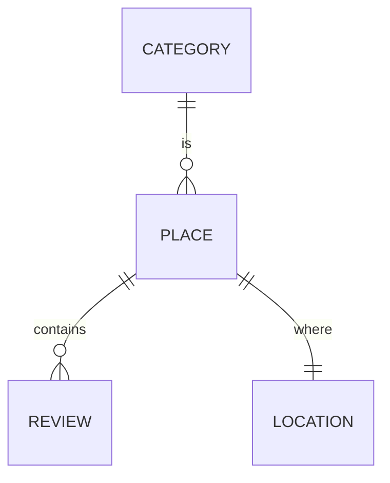

# Domain - 2024-11-04 #

## Revisions

- 2024-11-04: Initial draft
  - Aran Moncusi Ramirez

## Context
In developing the application for reviewing categorized places, we aim to create a robust and flexible domain model that
accurately reflects the business logic and requirements of the system. By employing Domain-Driven Design (DDD), we
intend to ensure that our model aligns closely with the real-world scenarios of users interacting with places and
reviews. This approach will facilitate better communication among stakeholders, improve maintainability, and enable the
system to evolve more easily as requirements change.

### Functions

- Create categories, places and reviews
- Get the places through geospatial query for an interactive map
- Recommendations for places
  - Must be not reviewed on the last 30 days
  - Prioritize the unreviewed places

> :spiral_notepad:  
> Because this is an interview challenge, and any stakeholders collaborate on the process, the final decision and
> the used language may not be completely right. The main objective for this ADR is to represents how I document and
> explain the decision process. That ADR only show the most basic entities in the Domain Layer, also the main use cases.

## Considerations
Key factors influencing the Domain design include:

- **Clarity of Business Logic**: The design should capture the essential business rules and logic governing places,
  reviews, and their relationships. This will help ensure that the implementation remains aligned with the domain
  language used by stakeholders.
- **Encapsulation of Behaviors**: Each entity should encapsulate relevant behaviors and state changes, promoting a clear
  understanding of how each entity interacts within the domain.
- **Aggregate Roots**: We need to identify aggregate roots to maintain consistency within transactions.
- **Bounded Contexts**: Understanding the boundaries of the domain model is critical. We must define which parts of the
  application belong to the same bounded context and how they interact with other contexts.
- **Flexibility and Evolution**: The model should be designed to accommodate future changes and feature enhancements
  without requiring significant refactoring. This includes anticipating potential new features related to places or
  reviews.
- **Testing and Validation**: The design should facilitate unit testing and validation of domain logic, ensuring that
  entities behave as expected in various scenarios.

## Decision

### Domain Models

